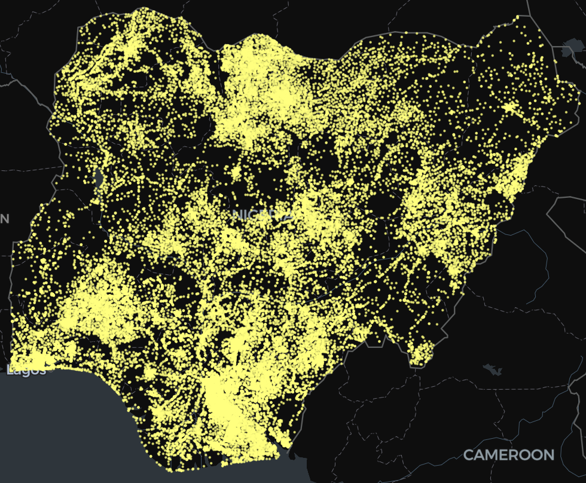

# Nigeria Geodata

<div style="text-align: center;">
    
    <p><em>A Python library for fast and efficient access to geospatial data for Nigeria.</em></p>
</div>

[![PyPI][pypi_badge]][pypi_link]
[![open_in_colab][colab_badge]][colab_notebook_link]
[![python_versions][supported_python_versions_badge]][pypi_link]

[pypi_badge]: https://img.shields.io/pypi/v/nigeria_geodata?color=%2334D058&label=pypi%20package
[pypi_link]: https://pypi.org/project/nigeria_geodata/
[colab_badge]: https://colab.research.google.com/assets/colab-badge.svg
[colab_notebook_link]: https://colab.research.google.com/github/jeafreezy/nigeria_geodata/blob/main
[supported_python_versions_badge]: https://img.shields.io/pypi/pyversions/fastapi.svg?color=%2334D058

---

**Documentation**: <a href="https://jeafreezy.github.io/nigeria_geodata" target="_blank">https://jeafreezy.github.io/nigeria_geodata/</a>

**Source Code**: <a href="https://github.com/jeafreezy/nigeria_geodata" target="_blank">https://github.com/jeafreezy/nigeria_geodata</a>

---

Nigeria Geodata is a fast and efficient Python client for accessing geospatial data for Nigeria.

The key features are:

- **High Performance**: Offers exceptional speed with both synchronous and asynchronous support to cater to different use cases and performance needs
- **Map Visualization**: Provides smooth map visualization using the fast [lonboard](https://developmentseed.org/lonboard/latest/) library.
- **Lightweight**: Minimal dependencies—just one required ([httpx](https://www.python-httpx.org/)), with optional extras available for additional features.
- **User-Friendly**: Easy to use and learn; set up quickly with just a few lines of code.
- **CLI Support**: Intuitive command-line interface built with Typer.
- **Real-Time Data**: Fetches up-to-date data directly from the [GRID3](https://grid3.org/) database (more to come!), ensuring you always work with the latest information.
- **Advanced Filtering**: Allows for precise filtering based on state names (e.g FCT, Lagos), bounding boxes (bbox), and areas of interest (AOI).

## Dependency

nigeria_geodata depends on only one core package:

- [Httpx](https://www.python-httpx.org/) - for the api requests.

## Additional Optional Dependencies

There are some additional dependencies you might want to install.

- [Typer](https://typer.tiangolo.com/) - for cli support.
- [Lonboard](https://developmentseed.org/lonboard/latest/) - for map visualization.
- [Geopandas](https://geopandas.org/en/stable/) - to return the data as a geodataframe.
- [Pandas](https://pandas.pydata.org/) - to return the data as a dataframe.

## Installation

Create and activate a virtual environment and then install nigeria_geodata:

To install the lightweight version using pip:

<!-- termynal -->

```py
pip install nigeria-geodata
---> 100%
```

This version will return all the data as Python objects, mostly as a list, and list of dicts.

To install it with `typer`, `lonboard` and `geopandas`:

<!-- termynal -->

```py
pip install nigeria-geodata['standard']
---> 100%
```

This version will allow you to get the data as a dataframe, geodataframe, or an interactive map.

<!-- termynal -->

```py
pip install nigeria-geodata['cli']
---> 100%
```

This version provides CLI support for the package. It is also lightweight -- It will return the data as pure Python objects.

## Get Started

For the simplest usecase, search for all the available health care data in Nigeria.

<!-- termynal -->

```py
from nigeria_geodata import Grid3, AsyncGrid3
# Sync
search_results = Grid3().search("health")
print(search_results)
# this will return a dataframe with all the available health care datasets.

# Async
search_results = await AsyncGrid3().search("health")
print(search_results)
# this will return a dataframe with all the available health care datasets.
```

Under the hood, this makes an api request to the GRID3 database to get the datasets. Refer to the **documentation** and **examples** for more use cases.

## Acknowledgment

In addition to the great libraries we're resting upon, we would also like to thank [GRID3](https://grid3.org/) for providing real-time and comprehensive geospatial data that powers this library.

## License

This project is licensed under the terms of the MIT license. See [LICENSE.MD](https://github.com/jeafreezy/nigeria_geodata?tab=License-1-ov-file).
