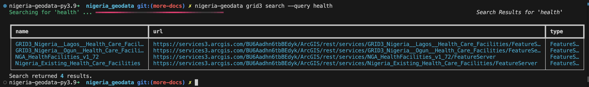
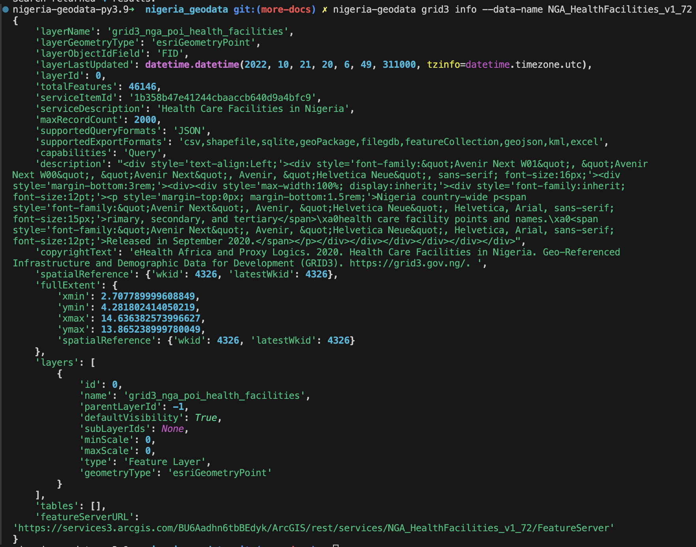

# Usage

## List all available datasets

By default, if `nigeria_geodata` finds pandas/geopandas already in your Python environment, it'll use it to render the results as a dataframe/geodataframe. However, you can disable this.

Note: If you require your results as a dataframe/geodataframe, and you don't have it installed in your environment already, you can install the `standard` version which will install them for you, otherwise it'll throw a `PackageNotFoundError`. However, you can disable dataframe/geodataframe. More information is provided below.

<!-- termynal -->

```py
pip install nigeria-geodata['standard']
---> 100%
```

### With dataframe (default)

```python
from nigeria_geodata import Grid3
grid3 = Grid3()
grid3.list_data()
# returns all the available datasets as a dataframe.
```

### Without dataframe

```python hl_lines="3"
from nigeria_geodata import Grid3
grid3 = Grid3()
grid3.list_data(dataframe=False)
# returns all the available datasets as an array.
```

## Search for a dataset

```python hl_lines="3"
from nigeria_geodata import Grid3
grid3 = Grid3()
grid3.search(query='Health')
# This will search through the GRDI3 database and return matching datasets.
```

If you're using the CLI, you'll see something like below. However, if you're using a Jupyter Notebook, you'll see a dataframe. Regardless of the environment, the results are the same.




## Get more information about a dataset

After searching for a data of interest, or after viewing all the available datasets using `list_data()` method, you can then copy the name of the dataset of interest to clipboard. Or you can access it programmatically.

### Clipboard

If you copied it to clipboard, just simply paste it here.

```python hl_lines="3"
from nigeria_geodata import Grid3
grid3 = Grid3()
info = grid3.info(data_name="NGA_HealthFacilities_v1_72") # replace with the name of the dataset of interest
print(info)
```
### Programmatic access

If you got the response above as a dataframe or as a list (depending on whether you set `dataframe` to True or False). You can simply acess the index of the data you want and grab the `name`.

```python hl_lines="3 4"
from nigeria_geodata import Grid3
grid3 = Grid3()
search_results=grid3.search(query='Health')
info = grid3.info(data_name=search_results[0]['Name']) # assuming the dataset of interest is in the first index.
print(info)
```




## Filter a dataset

Similarly, you can filter a dataset using several parameters.

### Bounding box

If you have the bounding box of your area of interest, you can pass it to the filter function.

```python hl_lines="4"
from nigeria_geodata import Grid3
grid3 = Grid3()
search_results=grid3.search(query='Health')
abuja_healthcare = grid3.filter(data_name=search_results[0]['Name'], bbox = [10.2, 3.4 , 5.6, 6.8]) # assuming Abuja bbox is this.
# print(abuja_healthcare)
```
This will return only the data about Abuja health care sites.

### State name
In addition to using the bounding box, which sometimes might extend beyong the actual boundary of the State/AOI, you can also use the State name. You can import the provided `enum`(recommended) from the `utils` module or you can type it manually (it is case inSEnsiTive).

```python hl_lines="5"
from nigeria_geodata import Grid3
from nigeria_geodata.utils import NigeriaState
grid3 = Grid3()
search_results=grid3.search(query='Health')
lagos_healthcare = grid3.filter(data_name=search_results[0]['Name'], state = NigeriaState.LAGOS)
# print(lagos_healthcare)
```

### AOI geometry

In addition to using the bounding box, or the state name,  you can also use a GeoJSON geometry.

Note: It must be a valid [GeoJSON Geometry](https://datatracker.ietf.org/doc/html/rfc7946), and can be of any geometry type.

```python hl_lines="2 3 4 5 6 7 8 9 10 11 12 13 16"
from nigeria_geodata import Grid3
aoi_geometry = {
  "type": "Polygon",
  "coordinates": [
    [
      [-77.0369, 38.9072],
      [-77.0369, 38.9172],
      [-77.0269, 38.9172],
      [-77.0269, 38.9072],
      [-77.0369, 38.9072]
    ]
  ]
}
grid3 = Grid3()
search_results=grid3.search(query='Health')
aoi_healthcare = grid3.filter(data_name=search_results[0]['Name'], aoi_geometry = aoi_geometry)
# print(aoi_healthcare)
```

### Interactive mapview

One of the interesting feature is an interactive map (powered by [Lonboard](https://developmentseed.org/lonboard/latest/)), which you can use to quickly visualize your dataset. This has only be tested to work in Notebook environment such as Jupyter Notebook.
To enable this, pass `preview=True` to the `filter()` method like below:

```python hl_lines="2 3 4 5 6 7 8 9 10 11 12 13 16"
from nigeria_geodata import Grid3
aoi_geometry = {
  "type": "Polygon",
  "coordinates": [
    [
      [-77.0369, 38.9072],
      [-77.0369, 38.9172],
      [-77.0269, 38.9172],
      [-77.0269, 38.9072],
      [-77.0369, 38.9072]
    ]
  ]
}
grid3 = Grid3()
search_results=grid3.search(query='Health')
aoi_healthcare = grid3.filter(data_name=search_results[0]['Name'], aoi_geometry = aoi_geometry, preview=True)
# print(aoi_healthcare)
```

<video src="../../assets/demo.mov" alt="Temporary logo" autoplay muted loop ></video>

### Without filters

without passing any filtering parameter, you will still get results, but it'll be for the whole country.

```python hl_lines="4"
from nigeria_geodata import Grid3
grid3 = Grid3()
search_results=grid3.search(query='Health')
aoi_healthcare = grid3.filter(data_name=search_results[0]['Name'])
# print(aoi_healthcare)
```

# Async

The async module has a similar functionality to the sync method described above, however it is faster and uses a different class like below:

```python hl_lines="2 3"
from nigeria_geodata import AsyncGrid3
grid3 = AsyncGrid3()
await grid3.list_data()
# returns all the available datasets as a dataframe.
```

See [benchmark](../benchmark.md) for speed tests of both sync/async.
